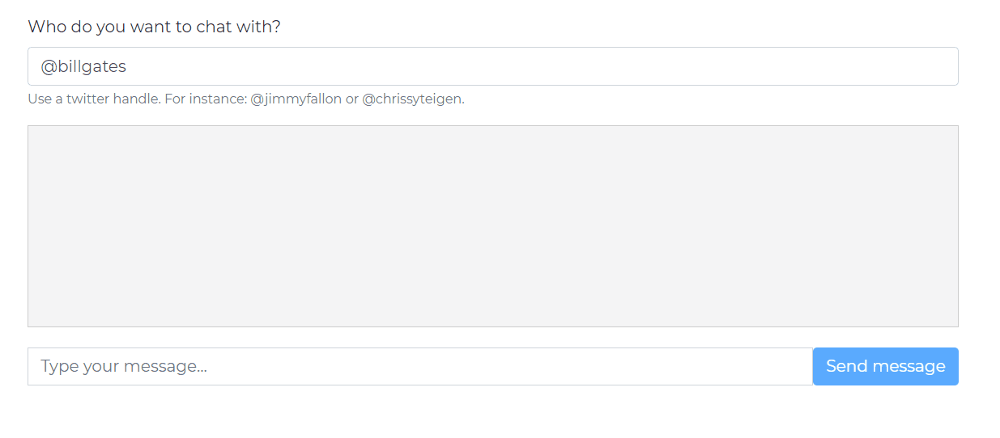

# Twitter Scraper Fetcher: MLH Python Workshop

This web app takes the user's message and a person's Twitter handle and uses the Twitter API to request 10,000 tweets from the person. The Flask Python library is used to handle requests and responses. Lastly, the app uses scraping and formatting techniques to clean the tweets and pass the information to the Markovify library (maintained by GitHub user jsvine) to generate appropriate responses.

### twitter_scraper_fetcher.py

Python file that contains functions which scrape data from Twitter.

### config.py

File that sets some global variables.

### requirements.txt

File that keeps track of which library versions are being used.

### main.py

Main Python script that starts the webpage and processes the scraper requests.

### static/ folder
Folder that contains the JavaScript, CSS and images that the web app uses.

### homepage.html

This launches the webpage of the Twitter app.

## Demonstration

